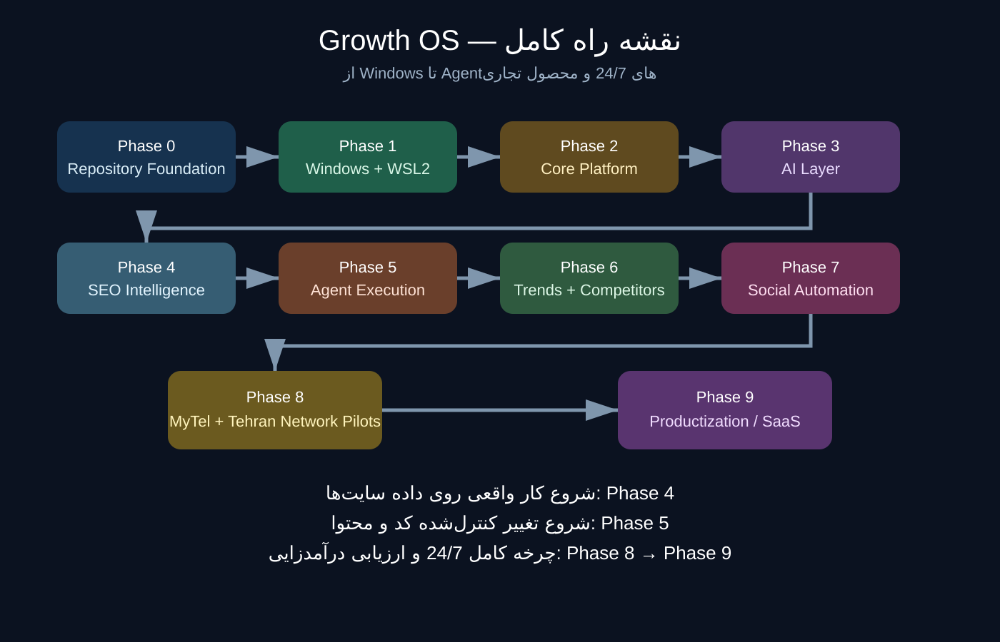

# Growth OS — راهنمای فارسی

> **اگر اولین بار است این ریپو را باز می‌کنی:** از [`growth-os/START-HERE-FA.md`](./growth-os/START-HERE-FA.md) شروع کن.

این ریپو مرجع طراحی، نصب، اجرا، عیب‌یابی و تبدیل سیستم Site-to-Growth Autopilot به محصول قابل فروش است.

Growth OS ابتدا روی دو سایت واقعی خودمان آزمایش می‌شود و بعد بر اساس نتیجه‌های اندازه‌گیری‌شده به یک سیستم چندسایتی و قابل درآمدزایی تبدیل خواهد شد. دانش و Playbook فعلی سئو حذف نشده و به‌صورت نسخه‌بندی‌شده در پوشه مرجع نگهداری می‌شود.

## پایلوت‌ها
- MyTel.one — حالت Growth برای بهینه‌سازی یک سایت موجود و نسبتاً کامل
- Tehran Network / tehnet.ir — حالت Build / Site Factory برای تکمیل یک سایت ناقص، سپس ورود به Growth Mode

## نقشه ریپو
- `AGENT.md` — وضعیت دقیق پروژه، کارهای انجام‌شده، خطاها، Verifyها و مرحله بعد
- `growth-os/START-HERE-FA.md` — راهنمای شروع فارسی برای کاربر مبتدی
- `growth-os/START-HERE-EN.md` — نسخه انگلیسی همان راهنما
- `growth-os/installation/` — نصب مرحله‌به‌مرحله و تصاویر/دیاگرام‌ها
- `growth-os/troubleshooting/` — خطاهای واقعی و راه‌حل‌های Verifyشده
- `SEO-REFERENCE-V1/` — تمام دانش و مستندات SEO قبل از شروع Growth OS
- `growth-os/` — معماری، عملیات، آزمایش‌ها، Benchmarkها، وضعیت هر سایت و مسیر محصول‌سازی
- `docs/superpowers/` — Specها و Planهای تأییدشده

## قانون اجرایی
هیچ مرحله‌ای صرفاً با «اجرا شدن» تمام‌شده محسوب نمی‌شود. ابتدا باید نتیجه Verify شود و بعد همان مرحله در `AGENT.md` با `[x]` ثبت شود. مرحله‌ای که Verify شده بدون دلیل یا Upgrade مصوب دوباره اجرا نمی‌شود.

## امنیت
هیچ رمز، PAT، API Key، OAuth Secret، Cookie، Session Token یا Secret واقعی نباید داخل Git ثبت شود. در مستندات فقط نام متغیرهای موردنیاز نوشته می‌شود، نه مقدار واقعی آن‌ها.

## مسیر کامل راه‌اندازی
1. Phase 0 — مرتب‌سازی و کنترل ریپو
2. Phase 1 — آماده‌سازی Windows / WSL2
3. Phase 2 — سرویس‌های پایه
4. Phase 3 — لایه هوش مصنوعی و Routing
5. Phase 4 — ابزارهای SEO Intelligence و اتصال داده سایت‌ها
6. Phase 5 — Agentهای اجرایی، Git/PR و Quality Gates
7. Phase 6 — پایش رقبا و Trendها
8. Phase 7 — شبکه‌های اجتماعی و انتشار خودکار
9. Phase 8 — اجرای کامل روی MyTel و Tehran Network
10. Phase 9 — تبدیل تجربه به محصول تجاری

از Phase 4 جمع‌آوری و تحلیل واقعی داده‌های سایت‌ها شروع می‌شود. از Phase 5 تغییر کنترل‌شده کد و محتوا توسط Agentها آغاز می‌شود. در Phase 8 چرخه کامل 24/7 شامل سایت، SEO، شبکه‌های اجتماعی، اندازه‌گیری و یادگیری روی دو پایلوت اعتبارسنجی می‌شود.

## وضعیت فعلی
برای وضعیت زنده و دقیق، همیشه `AGENT.md` را بخوان. در حال حاضر Phase 1 فعال است و WSL2 + Ubuntu 24.04 + GPU verification انجام شده‌اند.
