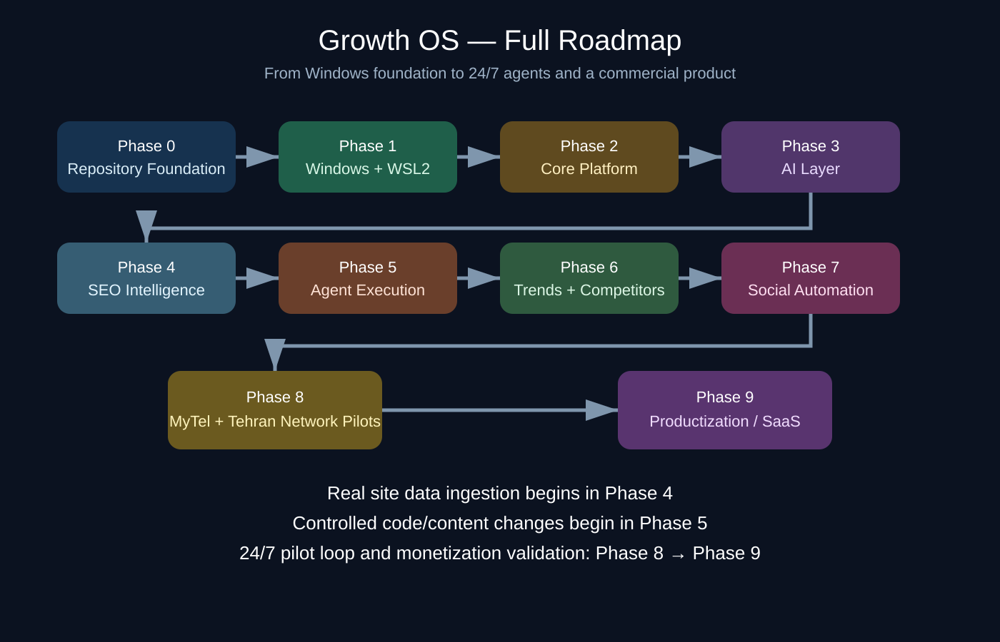

# Growth OS

> **First time here?** Start with [`growth-os/START-HERE-EN.md`](./growth-os/START-HERE-EN.md). Persian operator guide: [`README.fa.md`](./README.fa.md).

Site-to-Growth Autopilot research and implementation repository.

Growth OS is being built first on two real pilots, then hardened into a reusable commercial system. The repository keeps the original SEO operating knowledge intact while adding an auditable automation, AI-routing, site-building, growth, monitoring, and productization layer around it.

## Pilots
- MyTel.one — Growth Mode
- Tehran Network / tehnet.ir — Build Mode / Site Factory, then Growth Mode

## Repository map
- `AGENT.md` — live execution state, completed checks, incidents, and exact next task
- `README.fa.md` — Persian operator guide
- `growth-os/START-HERE-EN.md` — beginner-friendly English entry point
- `growth-os/START-HERE-FA.md` — beginner-friendly Persian entry point
- `growth-os/installation/` — step-by-step install runbooks plus visual assets
- `growth-os/troubleshooting/` — real incidents and verified remedies
- `SEO-REFERENCE-V1/` — preserved SEO knowledge base from the pre-bootstrap repository
- `growth-os/` — architecture, operations, experiments, benchmarks, per-site state, and productization documentation
- `docs/superpowers/` — approved designs and implementation plans

## Operating rule
No task is complete until verification passes and `AGENT.md` is updated. A completed task is not repeated unless its verification later fails or an intentional upgrade is approved.

## Security
Never commit credentials, OAuth secrets, API keys, PATs, cookies, session tokens, or other secret values. Documentation may name required environment variables but must never contain their real values.

## Delivery roadmap
1. Phase 0 — Repository Bootstrap
2. Phase 1 — Windows / WSL2 Foundation
3. Phase 2 — Core Platform
4. Phase 3 — AI Layer
5. Phase 4 — SEO Intelligence
6. Phase 5 — Agent Execution
7. Phase 6 — Intelligence Feeds
8. Phase 7 — Social Automation
9. Phase 8 — MyTel + Tehran Network Pilots
10. Phase 9 — Productization

Real site data collection begins in Phase 4. Controlled code/content execution begins in Phase 5. The full pilot loop across site, SEO, social, measurement, and autonomous iteration is validated in Phase 8.

## Current stage
Read `AGENT.md` for the live state. Phase 1 is currently active; WSL2, Ubuntu 24.04, WSL version verification, and RTX 3070 visibility have passed.
