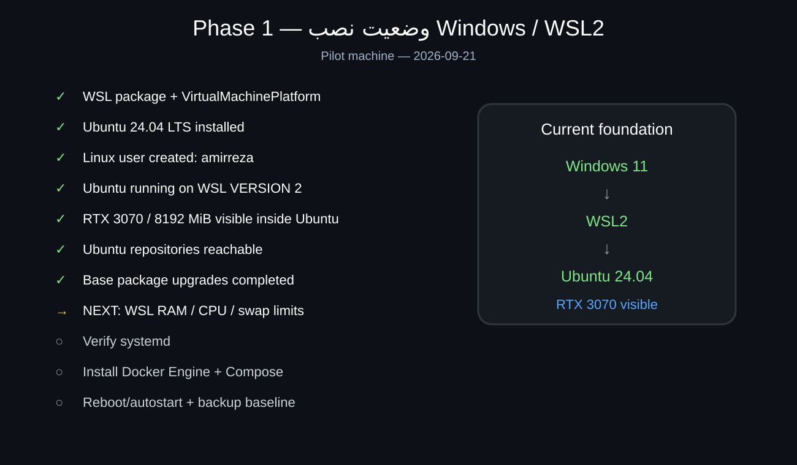

# از اینجا شروع کن — Growth OS

> **نکته مهم:** تا قبل از Merge شدن PR #1، این مستندات روی branch `growth-os-bootstrap` هستند. اگر GitHub را روی `main` باز کرده باشی، این فایل‌ها را نمی‌بینی. از منوی Branch در GitHub، `growth-os-bootstrap` را انتخاب کن.

این صفحه برای کسی نوشته شده که ممکن است Linux، WSL، Docker، Agent یا ابزارهای SEO را بلد نباشد. اگر بعداً خودت یا شخص دیگری خواست سیستم را از صفر نصب یا تعمیر کند، باید از همین صفحه شروع کند.

## الان کجای پروژه هستیم؟

وضعیت زنده پروژه همیشه در فایل [`../AGENT.md`](../AGENT.md) ثبت می‌شود. هر مرحله فقط بعد از Verify با `[x]` کامل می‌شود.

وضعیت فعلی در 2026-09-21:

- Phase 0: ساختار ریپو و مستندسازی آماده و PR باز است.
- Phase 1: WSL2 و Ubuntu 24.04 نصب شده‌اند.
- Ubuntu روی WSL VERSION 2 اجرا می‌شود.
- RTX 3070 با 8GB VRAM داخل Ubuntu دیده می‌شود.
- مخازن Ubuntu سالم هستند.
- `apt update` و `apt upgrade -y` با موفقیت انجام شده‌اند.
- مرحله بعد: تنظیم منابع WSL، بعد systemd و سپس Docker.

## راهنمای تصویری Phase 1

راهنمای کامل فارسی:

- [`installation/PHASE1-WSL2-FA.md`](./installation/PHASE1-WSL2-FA.md)

نسخه انگلیسی همان آموزش:

- [`installation/PHASE1-WSL2-EN.md`](./installation/PHASE1-WSL2-EN.md)

عیب‌یابی خطای واقعی HTTP 500 که در Pilot رخ داد:

- [`troubleshooting/INC-WSL2-0001-HTTP-500.md`](./troubleshooting/INC-WSL2-0001-HTTP-500.md)

## مسیر کلی پروژه

1. Phase 0 — Repository Foundation
2. Phase 1 — Windows / WSL2
3. Phase 2 — Core Platform
4. Phase 3 — AI Layer
5. Phase 4 — SEO Intelligence
6. Phase 5 — Agent Execution
7. Phase 6 — Trends / Competitors
8. Phase 7 — Social Automation
9. Phase 8 — MyTel + Tehran Network Pilot
10. Phase 9 — Productization / SaaS

## سایت‌ها چه زمانی وارد کار می‌شوند؟

- Phase 4: جمع‌آوری و Audit واقعی MyTel و Tehran Network شروع می‌شود.
- Phase 5: Agentها می‌توانند از طریق Branch/PR/QA تغییر کنترل‌شده روی کد و محتوا بدهند.
- Phase 8: چرخه کامل 24/7 روی دو سایت اجرا و اندازه‌گیری می‌شود.

## قانون امنیتی مهم

هیچ Password، PAT، API Key، OAuth Secret، Cookie یا Token واقعی نباید داخل Git ثبت شود. فقط نام متغیر Secret مستند می‌شود.

## اگر گیر کردی

1. اول مطمئن شو branch روی `growth-os-bootstrap` است؛ بعد از Merge این نکته حذف می‌شود.
2. `AGENT.md` را بخوان و `CURRENT_TASK` را پیدا کن.
3. آموزش Phase همان Task را باز کن.
4. اگر Error بود پوشه `troubleshooting/` را بررسی کن.
5. هیچ مرحله Verifyشده‌ای را دوباره اجرا نکن مگر اینکه مستندات صراحتاً Upgrade یا Recovery را دستور داده باشند.
