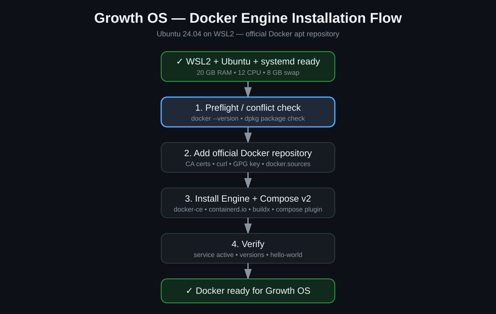

# Phase 1 — نصب Docker Engine + Docker Compose روی Ubuntu 24.04 در WSL2

این راهنما برای کاربری نوشته شده که Docker را نمی‌شناسد. هدف این مرحله نصب Docker Engine رسمی داخل Ubuntu 24.04 است. **Docker Desktop روی Windows نصب نمی‌کنیم.**



## Docker چیست؟

Docker به ما اجازه می‌دهد سرویس‌های Growth OS را داخل Containerهای جدا اجرا کنیم. به‌جای نصب دستی ده‌ها سرویس روی خود Ubuntu، هر سرویس محیط مستقل خودش را دارد و مدیریت، Backup و Update ساده‌تر می‌شود.

مثال آینده:

```text
Ubuntu / WSL2
└── Docker
    ├── PostgreSQL
    ├── Redis
    ├── n8n
    ├── OpenGSC
    ├── DispatchSEO
    └── Postiz
```

## پیش‌نیازهای این Pilot

قبل از Docker این موارد Verify شده‌اند:

- Ubuntu 24.04 LTS
- WSL VERSION 2
- systemd = running
- 20 GB سقف RAM برای WSL
- 12 CPU thread
- 8 GB swap
- RTX 3070 داخل WSL قابل مشاهده است

## روش انتخاب‌شده

Docker Engine از **مخزن رسمی apt خود Docker** نصب می‌شود. از convenience script ناشناس یا Docker Desktop استفاده نمی‌کنیم.

مرجع رسمی:

- https://docs.docker.com/engine/install/ubuntu/

---

## قدم 1 — بررسی Docker قدیمی یا پکیج‌های متداخل

داخل Ubuntu اجرا کن:

```bash
docker --version
```

و سپس:

```bash
dpkg -l | grep -E 'docker|containerd|runc'
```

اگر `docker: command not found` دیدی و دستور دوم چیزی مهم نشان نداد، یعنی نصب تمیز است.

اگر پکیج Docker/containerd/runc از قبل وجود داشت، قبل از ادامه خروجی را بررسی و ثبت کن. برای کاربر مبتدی حذف خودکار انجام نده.

---

## قدم 2 — نصب پیش‌نیازهای Repository رسمی

```bash
sudo apt update
sudo apt install -y ca-certificates curl
```

بعد پوشه Keyring را بساز:

```bash
sudo install -m 0755 -d /etc/apt/keyrings
```

کلید رسمی Docker را دانلود کن:

```bash
sudo curl -fsSL https://download.docker.com/linux/ubuntu/gpg -o /etc/apt/keyrings/docker.asc
```

و دسترسی خواندن بده:

```bash
sudo chmod a+r /etc/apt/keyrings/docker.asc
```

---

## قدم 3 — اضافه کردن Repository رسمی Docker

```bash
sudo tee /etc/apt/sources.list.d/docker.sources <<EOF
Types: deb
URIs: https://download.docker.com/linux/ubuntu
Suites: $(. /etc/os-release && echo "${UBUNTU_CODENAME:-$VERSION_CODENAME}")
Components: stable
Architectures: $(dpkg --print-architecture)
Signed-By: /etc/apt/keyrings/docker.asc
EOF
```

بعد:

```bash
sudo apt update
```

ادامه فقط وقتی مجاز است که Repository بدون خطای GPG/Release خوانده شود.

---

## قدم 4 — نصب Docker Engine و Compose Plugin

```bash
sudo apt install -y docker-ce docker-ce-cli containerd.io docker-buildx-plugin docker-compose-plugin
```

این پکیج‌ها شامل Docker Engine، CLI، containerd، Buildx و Docker Compose v2 هستند.

---

## قدم 5 — Verify سرویس Docker

```bash
systemctl is-active docker
```

انتظار:

```text
active
```

نسخه‌ها را ببین:

```bash
docker --version
docker compose version
```

سپس تست رسمی:

```bash
sudo docker run hello-world
```

اگر پیام موفقیت Docker نمایش داده شد، Engine کار می‌کند.

---

## قدم 6 — اجرای Docker بدون sudo

پس از Verify اولیه، کاربر `amirreza` را عضو گروه Docker می‌کنیم:

```bash
sudo usermod -aG docker $USER
```

بعد session باید Refresh شود. یکی از مسیرهای امن:

```bash
exit
```

و سپس از PowerShell دوباره Ubuntu را اجرا کن:

```powershell
wsl -d Ubuntu-24.04
```

حالا تست:

```bash
docker run hello-world
```

اگر بدون `sudo` اجرا شد، دسترسی درست است.

> هشدار: عضویت در گروه `docker` عملاً دسترسی سطح بالایی روی ماشین می‌دهد. فقط کاربر مدیریت‌شده خودمان عضو این گروه می‌شود.

---

## قدم 7 — Verify Compose

```bash
docker compose version
```

ما Compose v2 Plugin می‌خواهیم؛ دستور درست `docker compose` است، نه `docker-compose` قدیمی.

---

## قدم 8 — Reboot / Autostart Test

بعداً در P1-WSL-11 بررسی می‌کنیم که پس از shutdown/relaunch WSL:

```bash
systemctl is-active docker
```

همچنان `active` باشد.

---

## خطاهای متداول

### `docker: command not found`

Docker هنوز نصب نشده یا PATH/session به‌روزرسانی نشده است.

### `permission denied while trying to connect to the Docker daemon socket`

اگر Docker با `sudo` کار می‌کند ولی بدون sudo نه، معمولاً عضویت گروه Docker هنوز در session جدید اعمال نشده است.

### GPG / repository error

ادامه نده. خروجی `sudo apt update` را ثبت کن. Key یا Repository را با دستورهای تصادفی از اینترنت جایگزین نکن.

### Docker service inactive

```bash
systemctl status docker --no-pager
```

را اجرا و خروجی را ثبت کن. قبل از تغییر unit فایل یا reinstall، علت بررسی شود.

## قانون Verify

P1-WSL-10 فقط وقتی `[x]` می‌شود که این موارد پاس شوند:

- Docker Engine نصب شده باشد.
- `systemctl is-active docker` → `active`
- `docker --version` موفق باشد.
- `docker compose version` موفق باشد.
- `hello-world` اجرا شود.
- اجرای بدون sudo پس از refresh session تأیید شود.

تمام Errorها و Fixها باید در `AGENT.md` و در صورت نیاز `troubleshooting/` ثبت شوند.
