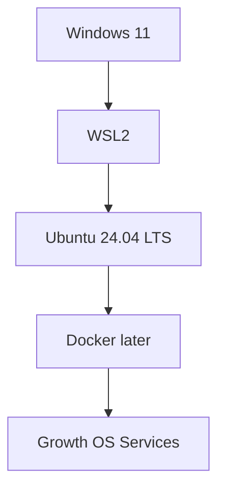
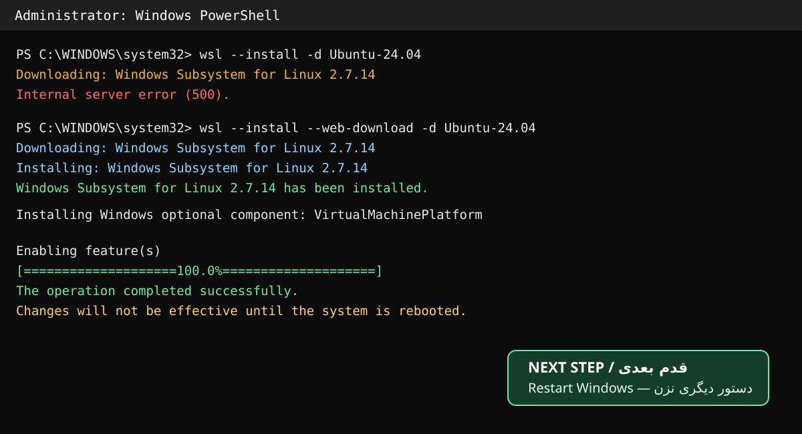

# Phase 1 — Install WSL2 and Ubuntu 24.04 on Windows 11

This guide is written for an operator with no prior Linux, WSL, or Docker experience. The goal of this step is only to create a clean Linux environment inside Windows. Docker, agents, and SEO services are not installed yet.

## What is WSL2?

WSL2 provides a real Linux environment inside Windows without VMware or dual boot.



Windows remains the normal desktop; Ubuntu runs the server-side Growth OS stack in the background.

## Pilot machine preflight — 2026-09-21

```text
WSL: not installed at start
Ubuntu: not installed at start
GPU: NVIDIA GeForce RTX 3070 Laptop GPU
VRAM: 8192 MiB
Windows NVIDIA Driver: 616.92
CUDA UMD reported by Windows: 13.4
```

## Step 1 — Open Administrator PowerShell

Open PowerShell with **Run as administrator**. The expected prompt is:

```text
PS C:\WINDOWS\system32>
```

## Step 2 — Install WSL2 and Ubuntu 24.04

Normal path:

```powershell
wsl --install -d Ubuntu-24.04
```

On the pilot machine this download path returned:

```text
Internal server error (500).
```

The documented alternative source was then used:

```powershell
wsl --install --web-download -d Ubuntu-24.04
```

This succeeded in installing WSL 2.7.14 and enabling `VirtualMachinePlatform` to 100%. Windows then reported that the changes require a reboot.



At this point run no additional setup command. Save work and restart Windows.

## Step 3 — Restart and first Ubuntu launch

After reboot, Ubuntu may launch automatically. If it does not, open Start and launch **Ubuntu 24.04**.

The first launch may take a few minutes. If prompted, create a simple lowercase UNIX username, for example:

```text
saman
```

Linux does not display password characters or asterisks while typing. This is normal.

A successful shell looks similar to:

```text
saman@COMPUTER:~$
```

## Step 4 — Verify from Windows

After reboot and Ubuntu initialization, run:

```powershell
wsl --status
wsl --list --verbose
```

Expected shape:

```text
NAME              STATE           VERSION
* Ubuntu-24.04    Running         2
```

The critical value is `VERSION 2`. If Ubuntu is missing or VERSION is 1, stop and record the output.

## Step 5 — Verify GPU inside Ubuntu

Inside Ubuntu run:

```bash
nvidia-smi
```

The RTX 3070 should be visible. Do not install a separate Linux NVIDIA display driver inside WSL for this check; WSL uses the Windows-side NVIDIA driver integration.

## Step 6 — Stop here

Do not install Docker, Ollama, LiteLLM, n8n, PostgreSQL, Redis, OpenHands, Postiz, OpenGSC, or DispatchSEO until the foundation is verified and recorded.

## Real incident: HTTP 500 during WSL download

The normal install path failed on this pilot with HTTP 500 while fetching WSL 2.7.14. Retrying through:

```powershell
wsl --install --web-download -d Ubuntu-24.04
```

successfully installed WSL 2.7.14 and enabled VirtualMachinePlatform. Full incident record:

`../troubleshooting/INC-WSL2-0001-HTTP-500.md`

## Operator checklist

- [x] Administrator PowerShell opened.
- [x] Normal WSL install path attempted.
- [x] HTTP 500 failure recorded.
- [x] `--web-download` fallback executed.
- [x] WSL 2.7.14 installed.
- [x] VirtualMachinePlatform enabled successfully.
- [ ] Windows rebooted.
- [ ] Ubuntu 24.04 initialized.
- [ ] Linux username created.
- [ ] `wsl --status` succeeds.
- [ ] `wsl --list --verbose` reports VERSION 2.
- [ ] `nvidia-smi` inside Ubuntu sees the RTX 3070.
- [ ] Final verification evidence recorded in `AGENT.md`.

## Safety / rollback

Do not run unregister/removal commands as a troubleshooting shortcut. Those can destroy the Linux distribution and its data. Record the error first, then follow a documented recovery step.

## Official references

- Microsoft Learn — Install WSL
- Microsoft Learn — Basic commands for WSL

This guide is updated with real pilot failures and fixes so it can later become a repeatable customer runbook.
