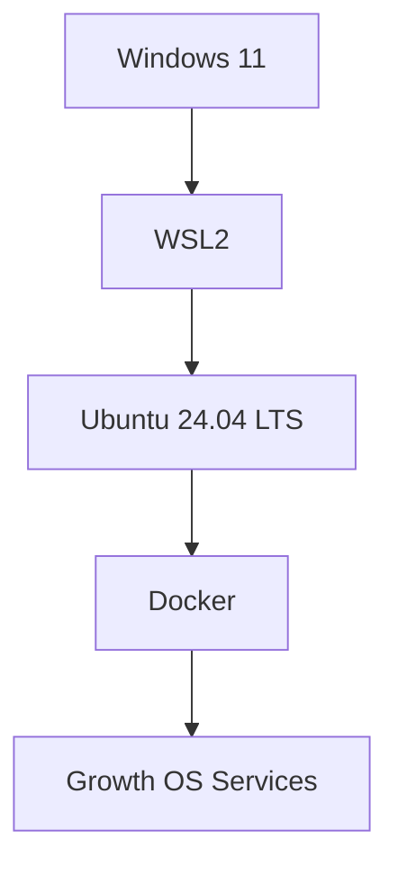
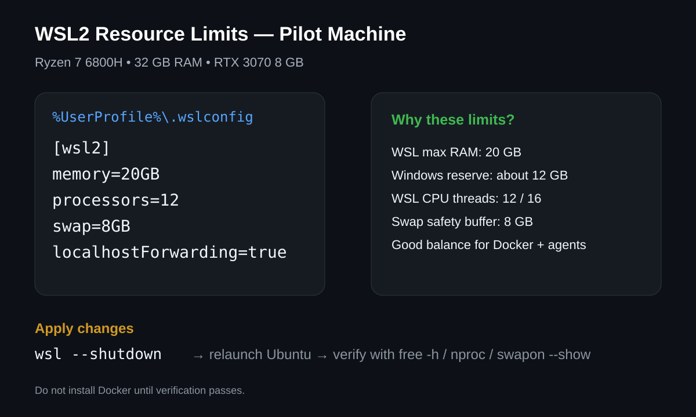

# Phase 1 — Install WSL2 and Ubuntu 24.04 on Windows 11

This guide is written for an operator with no prior Linux, WSL, or Docker experience. The goal is to build a clean, repeatable, supportable Linux environment inside Windows.

## What is WSL2?

WSL2 provides a real Linux environment inside Windows without VMware or dual boot.



Windows remains the normal desktop; Ubuntu runs the server-side Growth OS stack in the background.

## Pilot hardware

```text
CPU: AMD Ryzen 7 6800H — 8C / 16T
RAM: 32 GB
GPU: NVIDIA GeForce RTX 3070 Laptop GPU
VRAM: 8192 MiB
Windows NVIDIA Driver: 616.92
WSL package: 2.7.14
Ubuntu: 24.04 LTS
```

## Step 1 — Administrator PowerShell

Open PowerShell with **Run as administrator**.

Expected prompt:

```text
PS C:\WINDOWS\system32>
```

## Step 2 — Install WSL

Normal path:

```powershell
wsl --install -d Ubuntu-24.04
```

The pilot returned:

```text
Internal server error (500).
```

The fallback path that succeeded:

```powershell
wsl --install --web-download -d Ubuntu-24.04
```

This installed WSL 2.7.14 and enabled `VirtualMachinePlatform`, after which Windows required a reboot.


## Step 3 — Install Ubuntu 24.04

After reboot verify:

```powershell
wsl --status
wsl --list --verbose
wsl --list --online
```

If `Ubuntu-24.04` is available online but not installed, run:

```powershell
wsl --install --web-download -d Ubuntu-24.04
```

The pilot downloaded and installed Ubuntu 24.04 successfully.

## Step 4 — Create the Linux user

At the first-run prompt create a simple UNIX username. The pilot uses:

```text
amirreza
```

Linux does not display password characters while typing. This is normal.

A successful shell looks similar to:

```text
amirreza@Amirreza-PC:~$
```

## Step 5 — Verify WSL2

From PowerShell:

```powershell
wsl --list --verbose
```

Expected:

```text
Ubuntu-24.04    Running    2
```

The pilot passed this check.

## Step 6 — Verify GPU inside Ubuntu

Inside Ubuntu:

```bash
nvidia-smi
```

The RTX 3070 and about 8192 MiB VRAM should be visible. The pilot passed this check.

Do not install a separate Linux NVIDIA display driver inside WSL just for this test; WSL uses Windows-side NVIDIA integration.

## Step 7 — Update Ubuntu

Run:

```bash
sudo apt update
sudo apt upgrade -y
```

The pilot successfully refreshed package metadata and upgraded the pending base packages.

## Step 8 — Configure WSL resource governance

Exit Ubuntu:

```bash
exit
```

From Windows PowerShell:

```powershell
notepad $env:USERPROFILE\.wslconfig
```

Use this pilot configuration:

```ini
[wsl2]
memory=20GB
processors=12
swap=8GB
localhostForwarding=true
```



Why:

- 20 GB maximum RAM for WSL
- 12 of 16 CPU threads available to WSL
- 8 GB swap safety buffer
- Windows keeps roughly 12 GB RAM and 4 threads available for desktop use

Save the file, close Notepad, then apply it:

```powershell
wsl --shutdown
wsl -d Ubuntu-24.04
```

Verify inside Ubuntu:

```bash
free -h
nproc
swapon --show
```

Expected approximate values:

```text
Memory total: around 19–20 GiB
nproc: 12
Swap: around 8 GiB
```

Do not install Docker until these checks pass.

## Step 9 — systemd

After resource verification, verify systemd before Docker. This is still pending in the pilot.

## Pilot checklist

- [x] Administrator PowerShell
- [x] Normal WSL install attempted
- [x] HTTP 500 incident recorded
- [x] WSL installed through `--web-download`
- [x] VirtualMachinePlatform enabled
- [x] Windows rebooted
- [x] Ubuntu 24.04 installed
- [x] Linux user created
- [x] WSL VERSION 2 verified
- [x] RTX 3070 visible inside Ubuntu
- [x] `sudo apt update`
- [x] `sudo apt upgrade -y`
- [ ] `.wslconfig` created
- [ ] RAM / CPU / swap verified
- [ ] systemd verified
- [ ] Docker installed
- [ ] reboot/autostart tested
- [ ] baseline/backup recorded

## Troubleshooting

### HTTP 500 during WSL download

See:

`../troubleshooting/INC-WSL2-0001-HTTP-500.md`

### Ubuntu does not appear in Start

Use:

```powershell
wsl --list --verbose
wsl --list --online
```

If the distribution is not installed, install it directly through WSL rather than downloading Ubuntu Desktop/ISO.

### `.wslconfig` changes do not apply

Run:

```powershell
wsl --shutdown
```

then relaunch Ubuntu.

## Official references

- Microsoft Learn — Install WSL
- Microsoft Learn — Advanced settings configuration in WSL
- Microsoft Learn — Basic commands for WSL

This guide is updated from real pilot evidence so it can later serve as a customer-ready runbook.
