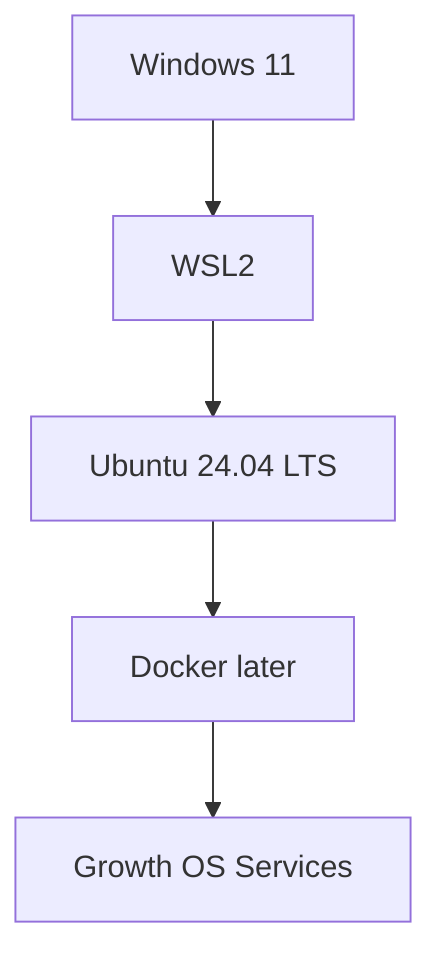

# Phase 1 — Install WSL2 and Ubuntu 24.04 on Windows 11

This guide is written for an operator with no prior Linux, WSL, or Docker experience. The goal of this step is only to create a clean Linux environment inside Windows. Docker, agents, and SEO services are not installed yet.

## What is WSL2?

WSL2 provides a real Linux environment inside Windows without VMware or dual boot.



Windows remains the normal desktop; Ubuntu runs the server-side Growth OS stack in the background.

## Pilot machine preflight — 2026-09-21

```text
WSL: not installed
Ubuntu: not installed
GPU: NVIDIA GeForce RTX 3070 Laptop GPU
VRAM: 8192 MiB
Windows NVIDIA Driver: 616.92
CUDA UMD reported by Windows: 13.4
```

The correct path for this pilot is a clean WSL2 installation.

## Step 1 — Open Administrator PowerShell

1. Open Start.
2. Search for `PowerShell`.
3. Right-click Windows PowerShell.
4. Choose **Run as administrator**.
5. Approve the Windows UAC prompt.

Expected prompt:

```text
PS C:\WINDOWS\system32>
```

## Step 2 — Install WSL2 and Ubuntu 24.04

Run:

```powershell
wsl --install -d Ubuntu-24.04
```

Microsoft documents `wsl --install` as the recommended Windows 11 installation path; `-d` selects the desired distribution.

If Windows requests a restart, save your work and restart the PC.

If download/install is stuck at `0.0%`, do not uninstall anything. Record the error first. Microsoft documents this fallback:

```powershell
wsl --install --web-download -d Ubuntu-24.04
```

Use it only after the normal path fails.

## Step 3 — First Ubuntu launch

After restart Ubuntu may open automatically. Otherwise launch **Ubuntu 24.04** from Start.

On the first launch, wait for initialization. You will be asked for a UNIX username and password.

Example username:

```text
saman
```

Linux does not display characters or asterisks while typing a password. This is normal.

A successful shell looks similar to:

```text
saman@COMPUTER:~$
```

## Step 4 — Verify from Windows

Run in PowerShell:

```powershell
wsl --status
```

Then:

```powershell
wsl --list --verbose
```

Expected shape:

```text
NAME              STATE           VERSION
* Ubuntu-24.04    Running         2
```

The important value is `VERSION 2`.

## Step 5 — Verify GPU inside Ubuntu

Inside the Ubuntu terminal run:

```bash
nvidia-smi
```

The NVIDIA RTX 3070 should be visible. Do not install a separate Linux NVIDIA display driver inside WSL for this step; WSL uses the Windows-side NVIDIA driver path.

## Step 6 — Stop here

Do not install Docker, Ollama, LiteLLM, n8n, PostgreSQL, Redis, OpenHands, Postiz, OpenGSC, or DispatchSEO yet. First record and verify this foundation.

## Operator checklist

- [ ] Administrator PowerShell opened.
- [ ] `wsl --install -d Ubuntu-24.04` executed.
- [ ] Windows restarted if requested.
- [ ] Ubuntu 24.04 initialized.
- [ ] Linux username created.
- [ ] `wsl --status` succeeds.
- [ ] `wsl --list --verbose` reports VERSION 2.
- [ ] `nvidia-smi` inside Ubuntu sees the RTX 3070.
- [ ] Verification evidence recorded in `AGENT.md`.

## Safety / rollback

Do not run unregister/removal commands as a troubleshooting shortcut. Those can destroy the Linux distribution and its data. Record the error first, then follow a documented recovery step.

## Official references

- Microsoft Learn — Install WSL
- Microsoft Learn — Basic commands for WSL

This guide is updated with real pilot failures and fixes so it can later become a repeatable customer runbook.
