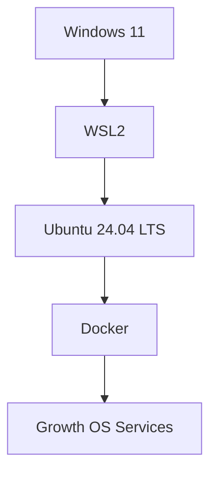

# Phase 1 — نصب WSL2 و Ubuntu 24.04 روی Windows 11

این راهنما برای کاربری نوشته شده که هیچ تجربه قبلی با Linux، WSL یا Docker ندارد. هدف این مرحله ساخت یک محیط Linux تمیز، قابل‌تکرار و قابل‌عیب‌یابی داخل Windows است.

## WSL2 چیست؟

WSL2 یعنی یک محیط Linux واقعی داخل Windows بدون نیاز به VMware یا نصب دوگانه سیستم‌عامل.



تو همچنان با Windows کار می‌کنی و Ubuntu پشت‌صحنه برای سرویس‌های سروری استفاده می‌شود.

## مشخصات Pilot

```text
CPU: AMD Ryzen 7 6800H — 8C / 16T
RAM: 32 GB
GPU: NVIDIA GeForce RTX 3070 Laptop GPU
VRAM: 8192 MiB
Windows NVIDIA Driver: 616.92
WSL package: 2.7.14
Ubuntu: 24.04 LTS
```

---

# قدم 1 — PowerShell Administrator

Start → PowerShell → راست‌کلیک → **Run as administrator**.

باید چیزی شبیه این ببینی:

```text
PS C:\WINDOWS\system32>
```

---

# قدم 2 — نصب WSL

مسیر عادی:

```powershell
wsl --install -d Ubuntu-24.04
```

در Pilot واقعی این مسیر هنگام دانلود WSL 2.7.14 با خطای زیر متوقف شد:

```text
Internal server error (500).
```

مسیر جایگزین رسمی که موفق شد:

```powershell
wsl --install --web-download -d Ubuntu-24.04
```

نتیجه واقعی:

```text
Windows Subsystem for Linux 2.7.14 has been installed.
VirtualMachinePlatform enabled successfully.
Changes will not be effective until the system is rebooted.
```


بعد Windows را Restart کن.

---

# قدم 3 — نصب خود Ubuntu 24.04

بعد از Restart وضعیت را بررسی کن:

```powershell
wsl --status
wsl --list --verbose
wsl --list --online
```

اگر `Ubuntu-24.04` در لیست آنلاین بود ولی Distribution نصب نبود، بزن:

```powershell
wsl --install --web-download -d Ubuntu-24.04
```

در Pilot واقعی Ubuntu 24.04 LTS با موفقیت دانلود و نصب شد.

---

# قدم 4 — ساخت کاربر Linux

در اولین اجرا Ubuntu می‌پرسد:

```text
Create a default Unix user account:
```

یک نام انگلیسی ساده انتخاب کن. در Pilot:

```text
amirreza
```

بعد Password را بساز. هنگام تایپ Password هیچ ستاره یا کاراکتری دیده نمی‌شود؛ طبیعی است.

اگر در پایان چیزی شبیه این دیدی، وارد Linux شده‌ای:

```text
amirreza@Amirreza-PC:~$
```

---

# قدم 5 — Verify اینکه WSL2 است

در PowerShell:

```powershell
wsl --list --verbose
```

باید `VERSION 2` ببینی:

```text
Ubuntu-24.04    Running    2
```

در Pilot این تست پاس شد.

---

# قدم 6 — Verify کارت گرافیک داخل Ubuntu

داخل Ubuntu:

```bash
nvidia-smi
```

باید RTX 3070 و حدود 8192 MiB VRAM دیده شود. در Pilot این تست پاس شد.

> برای این تست، درایور NVIDIA لینوکسی جداگانه داخل WSL نصب نکن. WSL از Integration درایور Windows استفاده می‌کند.

---

# قدم 7 — آپدیت Ubuntu

داخل Ubuntu:

```bash
sudo apt update
```

در Pilot:

```text
35.1 MB fetched
25 packages can be upgraded
```

بعد:

```bash
sudo apt upgrade -y
```

در Pilot این ارتقا بدون خطای fatal تمام شد و Shell برگشت.

---

# قدم 8 — محدودکردن RAM و CPU برای WSL

این مرحله مهم است چون نمی‌خواهیم Agentها و Docker تمام RAM سیستم را مصرف کنند.

در Ubuntu بزن:

```bash
exit
```

بعد در PowerShell Windows:

```powershell
notepad $env:USERPROFILE\.wslconfig
```

داخل فایل دقیقاً این را قرار بده:

```ini
[wsl2]
memory=20GB
processors=12
swap=8GB
localhostForwarding=true
```


### معنی تنظیمات

- `memory=20GB` → WSL حداکثر 20GB RAM می‌گیرد.
- `processors=12` → از 16 Thread سیستم، حداکثر 12 Thread در اختیار WSL است.
- `swap=8GB` → 8GB فضای Swap برای فشار حافظه.
- `localhostForwarding=true` → سرویس‌های WSL از Windows با localhost راحت‌تر قابل‌دسترسی‌اند.

این انتخاب برای Pilot با 32GB RAM عمداً حدود 12GB RAM و 4 Thread را برای خود Windows آزاد نگه می‌دارد.

بعد File → Save و Notepad را ببند.

در PowerShell بزن:

```powershell
wsl --shutdown
```

سپس دوباره Ubuntu را اجرا کن:

```powershell
wsl -d Ubuntu-24.04
```

داخل Ubuntu برای Verify بزن:

```bash
free -h
nproc
swapon --show
```

نتیجه مورد انتظار تقریبی:

```text
Memory total: حدود 19 تا 20 GiB
nproc: 12
Swap: حدود 8 GiB
```

تا وقتی این سه Verify پاس نشده‌اند، Docker نصب نکن.

---

# قدم 9 — systemd

بعد از Verify منابع، systemd را بررسی می‌کنیم. این مرحله هنوز در Pilot انجام نشده و باید قبل از Docker ثبت و Verify شود.

---

# چک‌لیست واقعی Pilot

- [x] PowerShell Administrator
- [x] تلاش نصب عادی WSL
- [x] ثبت خطای HTTP 500
- [x] نصب WSL با `--web-download`
- [x] فعال‌شدن VirtualMachinePlatform
- [x] Restart Windows
- [x] نصب Ubuntu 24.04
- [x] ساخت کاربر `amirreza`
- [x] Verify `VERSION 2`
- [x] Verify RTX 3070 داخل Ubuntu
- [x] `sudo apt update`
- [x] `sudo apt upgrade -y`
- [ ] ساخت `.wslconfig`
- [ ] Verify RAM / CPU / Swap
- [ ] Verify systemd
- [ ] نصب Docker
- [ ] تست reboot/autostart
- [ ] ثبت baseline/backup

---

# خطاهای واقعی و Troubleshooting

## HTTP 500 هنگام نصب WSL

رکورد کامل:

`../troubleshooting/INC-WSL2-0001-HTTP-500.md`

## Ubuntu در Start دیده نمی‌شود

اول با PowerShell بررسی کن:

```powershell
wsl --list --verbose
wsl --list --online
```

اگر Distribution نصب نیست، مستقیم از WSL نصبش کن و Ubuntu Desktop/ISO دانلود نکن.

## Password دیده نمی‌شود

طبیعی است؛ Linux موقع تایپ Password چیزی نمایش نمی‌دهد.

## `.wslconfig` اثر نکرد

بعد از Save باید حتماً:

```powershell
wsl --shutdown
```

اجرا شود و WSL دوباره بالا بیاید.

---

# منابع رسمی

- Microsoft Learn — Install WSL
- Microsoft Learn — Advanced settings configuration in WSL
- Microsoft Learn — Basic commands for WSL

این راهنما با نتیجه واقعی Pilot به‌روزرسانی می‌شود و هدف نهایی آن تبدیل‌شدن به Runbook قابل استفاده برای مشتری است.
