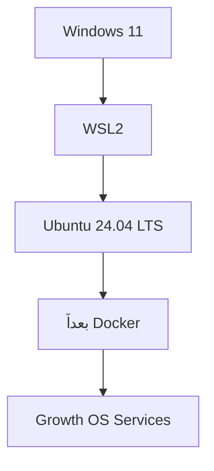

# Phase 1 — نصب WSL2 و Ubuntu 24.04 روی Windows 11

این راهنما برای کاربری نوشته شده که هیچ تجربه قبلی با Linux، WSL یا Docker ندارد. هدف این مرحله فقط ساخت محیط Linux تمیز داخل Windows است؛ هنوز Docker، Agentها یا ابزارهای SEO نصب نمی‌شوند.

## WSL2 چیست؟

WSL2 یعنی یک محیط Linux واقعی داخل Windows بدون نیاز به VMware یا نصب دوگانه سیستم‌عامل.



تو همچنان با Windows کار می‌کنی و Ubuntu پشت‌صحنه برای سرویس‌های سروری استفاده می‌شود.

## وضعیت این سیستم در 2026-09-21

نتیجه Preflight ثبت‌شده:

```text
WSL: در شروع نصب نبود
Ubuntu: در شروع نصب نبود
GPU: NVIDIA GeForce RTX 3070 Laptop GPU
VRAM: 8192 MiB
Windows NVIDIA Driver: 616.92
CUDA UMD reported by Windows: 13.4
```

پس مسیر درست این سیستم، نصب WSL2 از صفر است.

---

# قدم 1 — باز کردن PowerShell با دسترسی Administrator

1. روی Start کلیک کن.
2. بنویس `PowerShell`.
3. روی **Windows PowerShell** راست‌کلیک کن.
4. **Run as administrator** را بزن.
5. اگر پنجره تأیید Windows باز شد، **Yes** را بزن.

باید چیزی شبیه این ببینی:

```text
Windows PowerShell
PS C:\WINDOWS\system32>
```

---

# قدم 2 — نصب WSL2 و Ubuntu 24.04

در همان PowerShell Administrator این دستور را دقیقاً وارد کن:

```powershell
wsl --install -d Ubuntu-24.04
```

این دستور باید WSL، Virtual Machine Platform، Linux kernel و Ubuntu 24.04 را نصب کند.

طبق مستندات رسمی Microsoft، `wsl --install` روش توصیه‌شده نصب WSL روی Windows 11 است و با `-d` می‌توان توزیع موردنظر را تعیین کرد.

## نتیجه واقعی Pilot

در این سیستم مسیر عادی هنگام دانلود WSL 2.7.14 با خطای زیر متوقف شد:

```text
Internal server error (500).
```

بنابراین مسیر جایگزین رسمی اجرا شد:

```powershell
wsl --install --web-download -d Ubuntu-24.04
```

این بار WSL 2.7.14 نصب شد، `VirtualMachinePlatform` تا 100% فعال شد و Windows اعلام کرد برای مؤثرشدن تغییرات باید سیستم Restart شود.


در این نقطه **هیچ دستور دیگری اجرا نکن**. فایل‌های باز را ذخیره کن و Windows را Restart کن.

---

# قدم 3 — Restart و اولین اجرای Ubuntu

1. فایل‌های باز را Save کن.
2. Windows را Restart کن.
3. بعد از بالا آمدن Windows ممکن است Ubuntu خودکار باز شود.
4. اگر باز نشد، Start را باز کن و `Ubuntu 24.04` را جست‌وجو و اجرا کن.

اولین اجرا ممکن است چند دقیقه برای آماده‌سازی فایل‌ها زمان بخواهد.

اگر Ubuntu از تو Username خواست:

```text
Enter new UNIX username:
```

یک نام ساده انگلیسی انتخاب کن؛ مثال:

```text
saman
```

بعد Password می‌خواهد.

نکته مهم: هنگام تایپ Password در Linux هیچ ستاره یا کاراکتری روی صفحه نمی‌بینی. این طبیعی است. Password را تایپ کن و Enter بزن و دوباره تکرار کن.

وقتی تمام شد چیزی شبیه این می‌بینی:

```text
saman@COMPUTER:~$
```

این یعنی وارد Ubuntu شده‌ای.

---

# قدم 4 — Verify نصب از داخل Windows

بعد از Restart و اولین اجرای Ubuntu، PowerShell را باز کن و بزن:

```powershell
wsl --status
```

سپس:

```powershell
wsl --list --verbose
```

نتیجه مورد انتظار باید چیزی شبیه این باشد:

```text
NAME              STATE           VERSION
* Ubuntu-24.04    Running         2
```

مهم‌ترین قسمت:

```text
VERSION = 2
```

اگر Ubuntu در لیست نبود یا VERSION برابر 1 بود، ادامه نده و خروجی را ثبت کن.

---

# قدم 5 — Verify GPU داخل Ubuntu

داخل پنجره Ubuntu این دستور را اجرا کن:

```bash
nvidia-smi
```

باید RTX 3070 را ببینی. لازم نیست CUDA Toolkit را داخل Ubuntu نصب کنیم فقط برای اینکه `nvidia-smi` کار کند؛ WSL از درایور Windows استفاده می‌کند.

اگر `nvidia-smi` کار کرد، GPU access برای WSL آماده است.

---

# قدم 6 — فعلاً توقف

بعد از موفقیت قدم‌های بالا هنوز این‌ها را نصب نکن:

```text
Docker
Ollama
LiteLLM
n8n
PostgreSQL
Redis
OpenHands
Postiz
OpenGSC
DispatchSEO
```

اول خروجی Verifyها باید ثبت شود، بعد Phase 1 ادامه پیدا می‌کند.

---

# خطاهای رایج

## خطا: WSL نصب نیست

```text
The Windows Subsystem for Linux is not installed
```

راه‌حل مرحله فعلی:

```powershell
wsl --install -d Ubuntu-24.04
```

## خطا: `Internal server error (500)` هنگام دانلود

در Pilot واقعی این خطا رخ داد. بدون حذف یا دستکاری نصب، این دستور اجرا شد:

```powershell
wsl --install --web-download -d Ubuntu-24.04
```

نتیجه: دانلود و نصب WSL 2.7.14 و فعال‌سازی VirtualMachinePlatform موفق شد و Restart درخواست شد.

رکورد کامل Incident:

`../troubleshooting/INC-WSL2-0001-HTTP-500.md`

## نصب روی 0.0% گیر کرده

بعد از ثبت خطا می‌توان مسیر جایگزین زیر را بررسی کرد:

```powershell
wsl --install --web-download -d Ubuntu-24.04
```

## بعد از Restart Ubuntu باز نمی‌شود

PowerShell را باز کن و ابتدا فقط این را بزن:

```powershell
wsl --list --verbose
```

خروجی را ثبت کن و قبل از حذف یا `unregister` کردن Ubuntu بررسی انجام بده.

## Password دیده نمی‌شود

طبیعی است. Linux هنگام تایپ Password چیزی نشان نمی‌دهد.

---

# چک‌لیست اپراتور

- [x] PowerShell به صورت Administrator باز شد.
- [x] مسیر عادی `wsl --install -d Ubuntu-24.04` امتحان شد.
- [x] خطای HTTP 500 ثبت شد.
- [x] مسیر `--web-download` اجرا شد.
- [x] WSL 2.7.14 نصب شد.
- [x] VirtualMachinePlatform با موفقیت فعال شد.
- [ ] Windows Restart شد.
- [ ] Ubuntu 24.04 اولین بار اجرا شد.
- [ ] Linux username ساخته شد.
- [ ] `wsl --status` بدون خطا اجرا شد.
- [ ] `wsl --list --verbose` نشان داد Ubuntu روی VERSION 2 است.
- [ ] `nvidia-smi` داخل Ubuntu کارت RTX 3070 را نشان داد.
- [ ] نتیجه Verify نهایی در `AGENT.md` ثبت شد.

## Rollback / حذف اضطراری

در این مرحله اگر نصب ناقص شد، قبل از حذف یا `unregister` کردن Ubuntu ابتدا خطا باید ثبت و بررسی شود. دستورهای حذف عمداً در این راهنمای شروع قرار داده نشده‌اند تا کاربر تازه‌کار تصادفاً داده Linux را پاک نکند.

## منابع رسمی

- Microsoft Learn — Install WSL
- Microsoft Learn — Basic commands for WSL

این راهنما با هر تغییر واقعی در نصب، خطا یا راه‌حل روی سیستم Pilot به‌روزرسانی می‌شود تا بعداً به Runbook قابل استفاده برای مشتری تبدیل شود.
