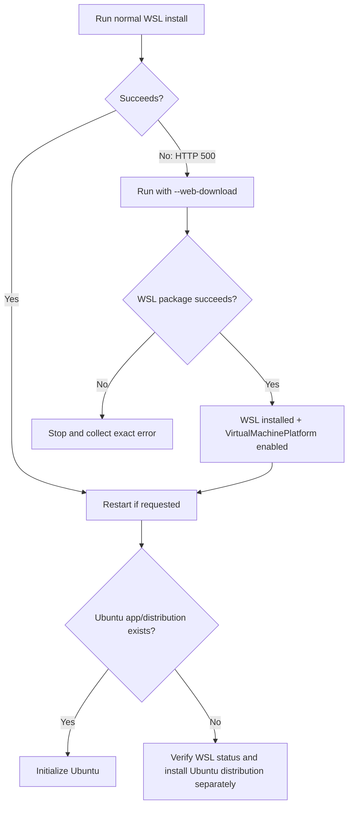

# INC-WSL2-0001 — WSL install returned HTTP 500

Date: 2026-09-21
Status: WORKAROUND_SUCCEEDED — Ubuntu distribution install pending
Environment: Windows 11, WSL not previously installed

## Symptom

The operator first ran:

```powershell
wsl --install -d Ubuntu-24.04
```

Observed output:

```text
Downloading: Windows Subsystem for Linux 2.7.14
Internal server error (500).
```

The command returned to the PowerShell prompt.

## Interpretation

The failure occurred while the WSL package was being downloaded. It did not indicate a GPU failure and did not prove that Windows virtualization was broken.

Microsoft documents `--web-download` as an alternative install source instead of the normal Microsoft Store-backed path.

## Visual decision flow



## Workaround used

The operator ran:

```powershell
wsl --install --web-download -d Ubuntu-24.04
```

Observed successful output included:

```text
Downloading: Windows Subsystem for Linux 2.7.14
Installing: Windows Subsystem for Linux 2.7.14
Windows Subsystem for Linux 2.7.14 has been installed.
Installing Windows optional component: VirtualMachinePlatform
[====================100.0%====================]
The operation completed successfully.
The requested operation is successful. Changes will not be effective until the system is rebooted.
```

Visual training asset:

`../installation/assets/wsl2-step-02-web-download-success.svg`

## Post-reboot observation

After the required Windows restart, searching Start for `Ubuntu 24.04` did not show an installed Ubuntu application; Windows Search showed web results only. This indicates that the WSL runtime/VirtualMachinePlatform installation completed, while the Ubuntu distribution itself still needs to be verified and, if absent, installed separately.

Do not download Ubuntu Desktop ISO or install VMware for this case.

## Current next operator action

Open **PowerShell as Administrator** and run only these diagnostic commands first:

```powershell
wsl --status
wsl --list --verbose
wsl --list --online
```

If `Ubuntu-24.04` is not present in the installed distribution list but is present in the online list, install the distribution with:

```powershell
wsl --install --web-download -d Ubuntu-24.04
```

Then allow Ubuntu to initialize and create the UNIX username/password.

## Resolution criteria

This incident is not marked RESOLVED until all of these are verified:

- Windows rebooted after enabling VirtualMachinePlatform.
- Ubuntu 24.04 initializes successfully.
- `wsl --status` succeeds.
- `wsl --list --verbose` shows Ubuntu 24.04 using WSL version 2.

## Safety

Do not run uninstall, unregister, DISM removal, Docker installation, Ubuntu Desktop ISO installation, or VMware installation as a shortcut.

## Official references

- Microsoft Learn — Install WSL
- Microsoft Learn — Basic commands for WSL
- Microsoft Learn — Manual installation steps for problematic install paths
