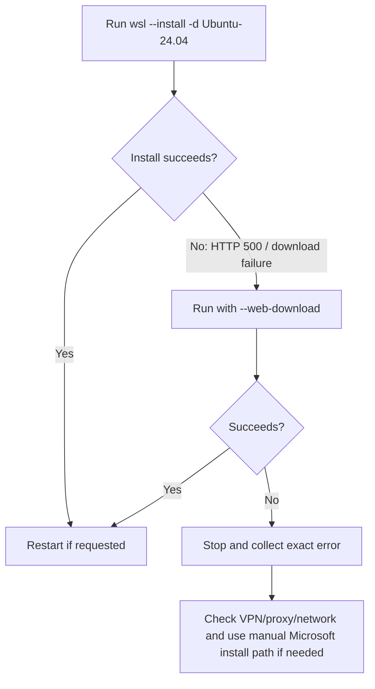

# INC-WSL2-0001 — WSL install returned HTTP 500

Date: 2026-09-21
Status: OPEN — retry pending
Environment: Windows 11, WSL not previously installed

## Symptom

The operator ran:

```powershell
wsl --install -d Ubuntu-24.04
```

Observed output:

```text
Downloading: Windows Subsystem for Linux 2.7.14
Internal server error (500).
```

The command then returned to the PowerShell prompt.

## Interpretation

The failure occurred while the WSL package was being downloaded. It does not indicate a GPU failure and does not prove that Windows virtualization is broken.

Microsoft documents `--web-download` as an alternative install source instead of the Microsoft Store path.

## Visual decision flow



## Next operator action

Run only this command in Administrator PowerShell:

```powershell
wsl --install --web-download -d Ubuntu-24.04
```

Do not run uninstall, unregister, DISM removal, Docker installation, or Ubuntu cleanup commands yet.

## Verification after successful retry

Do not mark this incident resolved until these commands work:

```powershell
wsl --status
wsl --list --verbose
```

Expected later state:

```text
Ubuntu-24.04    ...    VERSION 2
```

## If the retry also fails

Stop and preserve the complete error text. The next troubleshooting branch is to distinguish:

- Microsoft Store/download path issue;
- VPN/proxy/network filtering;
- Windows optional-feature/virtualization issue;
- need for Microsoft's documented manual Appx/AppxBundle installation path.

No destructive repair should be attempted before that distinction is made.

## Official references

- Microsoft Learn — Install WSL
- Microsoft Learn — Basic commands for WSL
- Microsoft Learn — Manual installation steps for older/problematic install paths
